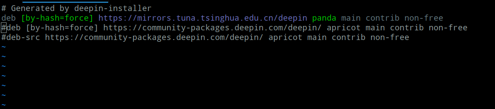

# deepin 安装msyql 失败 错误：没有可用的软件包 mysql - client 但是它被其他的软件包引用了 没有可用的软件包 mysql - service 但是它被其他的软件包引用了

deepin安装msyql 是失败的问题：


解决方法：

需要更换deepin的官方的源，配上自己的源，这里使用的清华的源！

首先要去到
```
cd /etc/apt/ 
```
复制该sources.list 文件并重命名
 
```
sudo cp sources.list sourcesCopy.list
```
编辑该文件
```
sudo vim sources.list
```
把其他的注释掉，加上一下命令
```
deb [by-hash=force] https://mirrors.tuna.tsinghua.edu.cn/deepin panda main contrib non-free
```


保存退出！执行
```
sudo apt-get update  
sudo apt-get upgrade
```   
命令，更新源，需要的时间有点长

然后使用命令安装mysql！
```
sudo apt-get install mysql-server mysql-client
```
安装完之后，查看账号和密码！
```
sudo cat /etc/mysql/debian.cnf
```
然后登录msyql 修改账号和密码
```
mysql
```
```
use mysql;

update user set plugin="mysql_native_password",authentication_string=password('123456') where user="root";
```


重启服务
```
/etc/init.d/mysql restart
```
使用刚修改好的账号和密码登录验证


进入mysql那就成功了！

最后就是修改了字符编码了
编辑配置文件
```
 sudo vim /etc/mysql/mysql.conf.d/mysqld.cnf
```

```
[client]

default-character-set=utf8

[mysql]

default-character-set=utf8

[mysqld]

character-set-server=utf8
```


重启服务
```
/etc/init.d/mysql restart
```

进入数据库查看编码：
```
SHOW VARIABLES LIKE 'char%';
```

